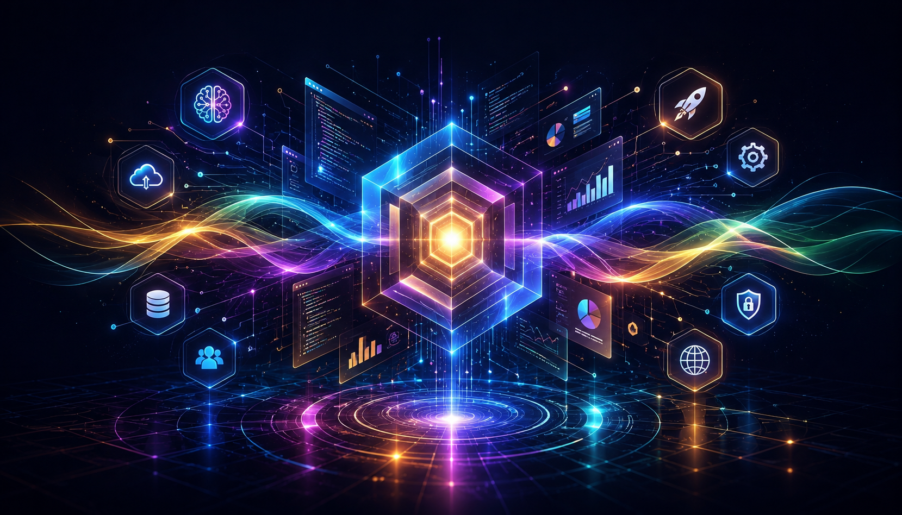

<p align="center">
  
</p>

<h1 align="center">Exciting to bring your vision of life !</h1>

<p align="center">
  Building polished digital products where clean interfaces, strong architecture, and immersive interaction work together.
</p>

<p align="center">
  <a href="https://github.com/CoraCote?tab=repositories">Projects</a> .
  <a href="https://www.leetcode.com/chetannada">LeetCode</a> .
  <a href="https://www.hackerrank.com/chetannada">HackerRank</a>
</p>

---

### What I Build

I turn ambitious ideas into web and mobile products that feel fast, elegant, and alive. My work sits where product thinking meets engineering depth: responsive interfaces, scalable APIs, real-time features, 3D experiences, and computer-vision powered interaction.

- **Web platforms:** Next.js, React, TypeScript, Node.js, Payload CMS
- **Mobile apps:** smooth cross-platform UX, real-time features, clean state management
- **3D configurators:** interactive product builders, scene control, visual customization, WebGL-ready flows
- **Computer vision:** OpenCV, object tracking, visual detection, camera-based product experiences
- **Backend foundations:** Python, FastAPI, PostgreSQL, MongoDB, REST, GraphQL
- **Delivery:** Docker, CI/CD, GitHub Actions, testing, cloud-ready deployment

---

### Tech Stack

<p align="center">
  
  
  
  
  
  
  
  
  
  
  
  
  
</p>

---

### Engineering Style

```txt
Design the feeling. Engineer the system. Ship the experience.
```

- I build interfaces that feel intentional from the first tap to the final edge case.
- I design frontend architecture that stays readable as products grow.
- I connect beautiful UI with dependable APIs, data flows, and release pipelines.
- I enjoy product work where design, engineering, and motion need to tell one story.

---

### Current Focus

- Web apps with sharp UX, scalable structure, and production-grade performance
- Mobile experiences with real-time behavior and smooth interaction details
- 3D product configurators for commerce, visualization, and custom workflows
- OpenCV and object tracking for camera-based features and intelligent interfaces

---

### Let's Build

If you are building something ambitious across **web or mobile**, I bring the technical depth, product sense, and execution discipline to make it feel simple, powerful, and ready for real users.

<p align="center">
  <b>Fast interfaces. Clear systems. Wonderful products. :)</b>
</p>
